<!--
*** Thanks for checking out this README Template. If you have a suggestion that would
*** make this better, please fork the repo and create a pull request or simply open
*** an issue with the tag "enhancement".
*** Thanks again! Now go create something AMAZING! :D
-->

# Brain Dev Documentation

<!-- PROJECT LOGO -->
<p align="center">
  <a href="https://github.com/Team-03-BrainDev/client-application">
    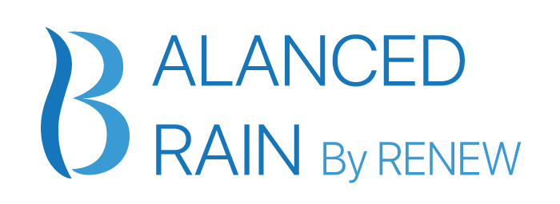
  </a>
  <a href="https://github.com/Team-03-BrainDev">
    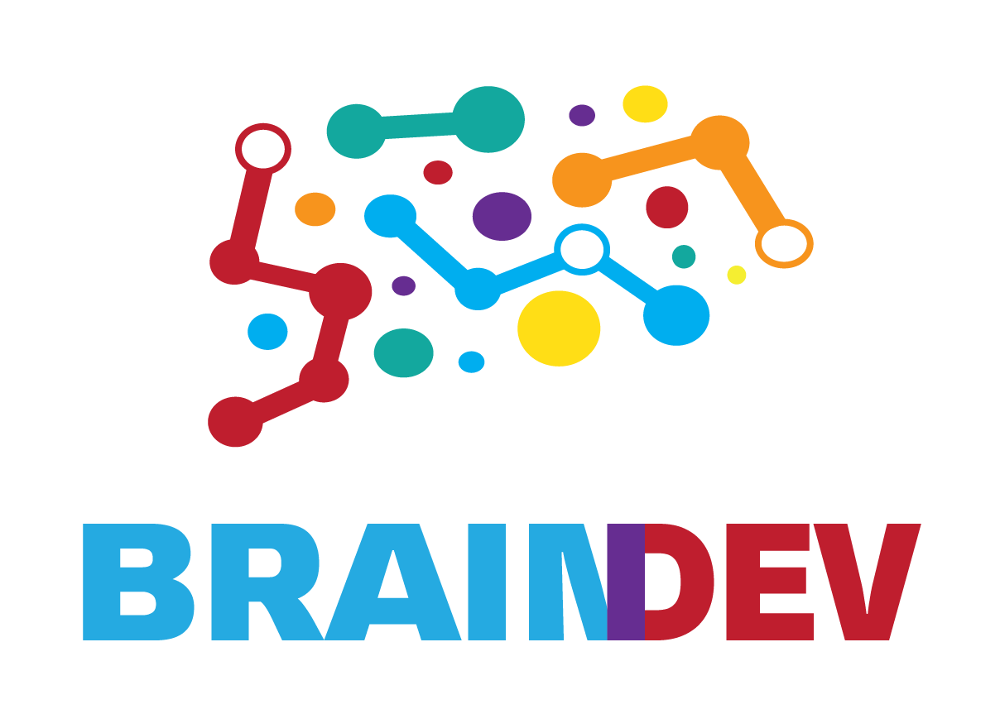
  </a>

  <h3 align="center">Brain Dev</h3>

  <p align="center">
    Add your tagline
    <br />
    <a href="https://github.com/Team-03-BrainDev/client-application#readme"><strong>Explore the docs »</strong></a>
    <br />
    <br />
    <a href="https://drive.google.com/file/d/1TboNtNL9bd1rT-zso9twuH2n0mCvlNox/view">View Demo</a>
    ·
    <a href="https://docs.google.com/spreadsheets/d/19Iv0WUqbZI-6tQeIjLiIz9xfiF8o5nwe-TvQccDtBgg/edit#gid=624910397">Report Bug</a>
    ·
    <a href="">Request Feature</a>
    ·
    <a href="">APP Docs</a>
    ·
    <a href="">Dashboard Docs</a>
  </p>
</p>

<!-- TABLE OF CONTENTS -->

## Table of Contents

- [Brain Dev Documentation](#brain-dev-documentation)
  - [Table of Contents](#table-of-contents)
  - [About The Project](#about-the-project)
    - [Built With](#built-with)
      - [Major Frameworks](#major-frameworks)
      - [Development Toolkit:](#development-toolkit)
      - [Accounts made for the braindev.team03@gmail.com under the specified password](#accounts-made-for-the-braindevteam03gmailcom-under-the-specified-password)
  - [Features ***](#features-)
      - [Admin Features](#admin-features)
      - [Therapist Features](#therapist-features)
      - [Patient Features](#patient-features)
  - [User Research](#user-research)
  - [Product Research](#product-research)
  - [Personas](#personas)
  - [Usage Scenarios](#usage-scenarios)
  - [Information Architecture](#information-architecture)
  - [Paper Prototype](#paper-prototype)
  - [Wireframes](#wireframes)
  - [Visual Design](#visual-design)
  - [Interactive Visual MockUp](#interactive-visual-mockup)
  - [Usability Testing Documentation](#usability-testing-documentation)
  - [Usability Test Results](#usability-test-results)
  - [High-Level Architecture](#high-level-architecture)
  - [Technical Research](#technical-research)
  - [Getting Started](#getting-started)
    - [Prerequisites](#prerequisites)
      - [Brain Dev Mobile App/Dashboard](#brain-dev-mobile-appdashboard)
  - [Usage **](#usage-)
      - [Current Screens in Development for Phase 1:](#current-screens-in-development-for-phase-1)
  - [Roadmap](#roadmap)
      - [Sprint Two Features](#sprint-two-features)
      - [Current Issues ***](#current-issues-)
  - [Contact](#contact)
  - [Acknowledgements](#acknowledgements)

<!-- ABOUT THE PROJECT -->

## About The Project

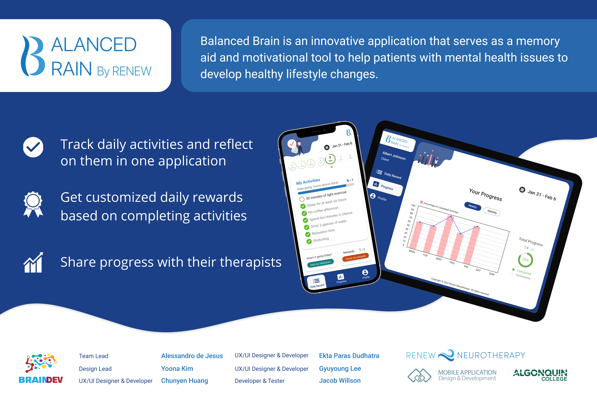

Balanced Brain is an innovative application that serves as a memory aid and motivational tool to help patients with mental health issues to develop healthy lifestyle changes. RE/ACTION YouTube link. ** CHANGE ** 

### Built With

#### Major Frameworks

- [Node JS](https://nodejs.org/en/docs/)
- [Tailwind](https://tailwindcss.com/docs/installation)
- [Next JS](https://nextjs.org/docs)
- [Firebase](https://firebase.google.com/)

#### Development Toolkit:

- [VS Code](https://code.visualstudio.com/) (IDE)
- [ChartJS](https://www.chartjs.org/)
- [Mintlify](https://www.mintlify.com/)

#### Accounts made for the braindev.team03@gmail.com under the specified password

- [x] Firebase - created under braindev.team03@gmail.com
- [x] Netlify - With Web Deployed created under braindev.team03@gmail.com

<!-- Features list -->

## Features ***

#### Admin Features
- [x] User management – multi-level access system
  - [x] CRUD Therapists profiles
  - [x] CRUD patient’s profiles
- [x] Export patient data/profile to a PDF
- [x] Assign a new therapist to a patient
- [x] CRUD default BBPP questions
- [x] CRUD default Reflection questions
- [x] CRUD default rewards
- [x] CRUD motivational quotes


#### Therapist Features
- [x] CRUD patients’ profiles
- [x] CRUD goals/TODO List (i.e., BBPP questions) to a patient
  - [x] BREAD BBPP questions for a patient
- [x] BREAD Reflection questions – customize it for a patient
- [x] CRUD and assign rewards to patients
- [x] CRUD default BBPP questions
- [x] CRUD default Reflection questions
- [x] CRUD default rewards
- [x] CRUD motivational quotes
- [x] Track patient’s overall well-being, score and reflection answers

#### Patient Features
- [x] Amass points for each healthy behavior/action completed (cross off items in a TODO List)
- [x] Answer reflection questions
- [x] Track well-being and score
- [x] BREAD self-rewards
- [x] Turn on/off notifications
- [x] Select their own taks (optional):
  Some patients might need this option. Therefore, the Therapist will have the option to grant this kind of access to a patient. 

<!-- User Research -->

## User Research

[User Research](https://drive.google.com/drive/u/1/folders/1P6loy_uq0fBZH9U9F8bD2zHN_GITFzRL)

- Resarch data from interviews with potential users. 

<!-- Product Research -->

## Product Research

[Product Research](https://drive.google.com/drive/u/1/folders/1mfXqkWhI_G_N7gj5uCJ78A6tkg5nee3T)

- Research about the market, our competitors, and brand.

<!-- Personas -->

## Personas

[Personas](https://drive.google.com/drive/u/1/folders/1zvVsiEtpzdyzyhVl-X5VddeTyZtucER6)

- Five personas one for admin, three for primary users (patient or equivalent) and one for secondary users (therapist).

<!-- Usage Scenarios -->

## Usage Scenarios

[Usage Scenarios](https://drive.google.com/drive/u/1/folders/1IYdY7Fkko54OxRdvuxkAn1JKAXSkVZlr)

- Five Scenarios one for admin, three for primary users (patient or equivalent) and two for secondary users(therapist). 

<!-- Information Architecture -->

## Information Architecture


- Information Architecture to lay out the structure of Balanced Brain.

<!-- Paper Prototyep -->

## Paper Prototype

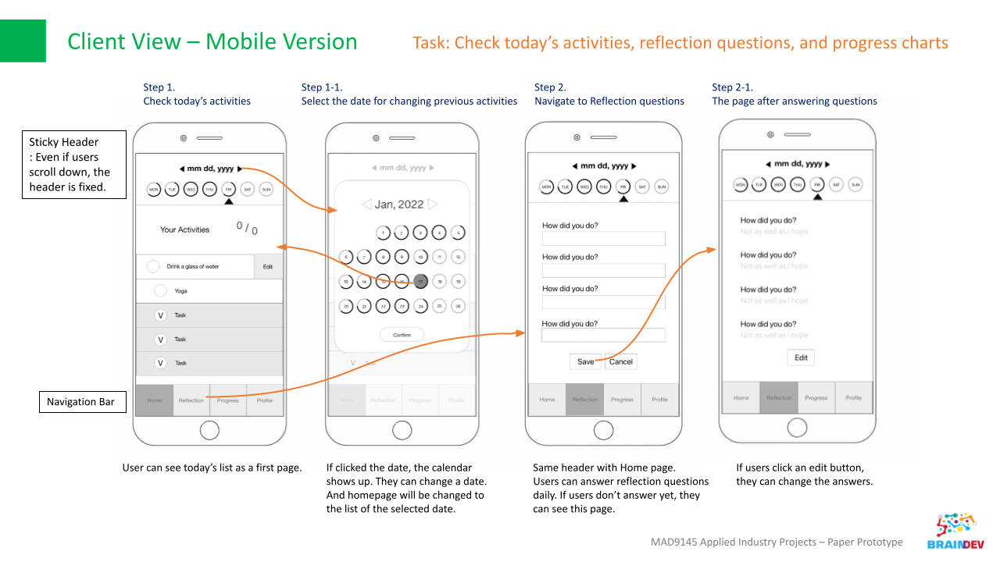

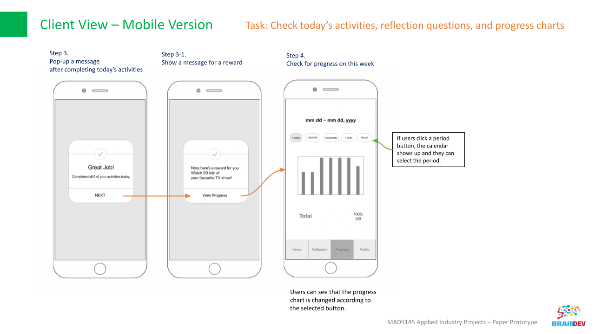

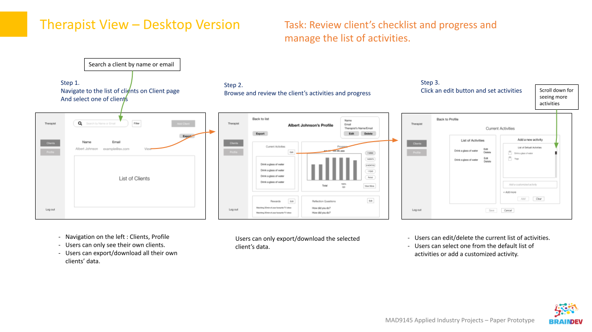

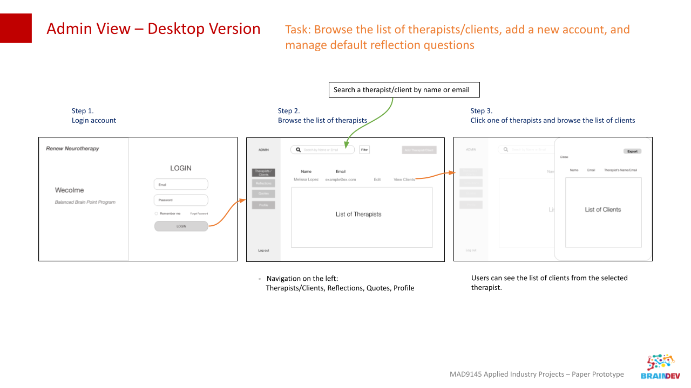

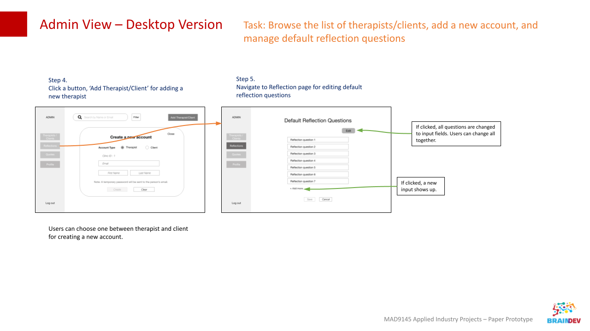


<!-- Wireframes -->

## Wireframes

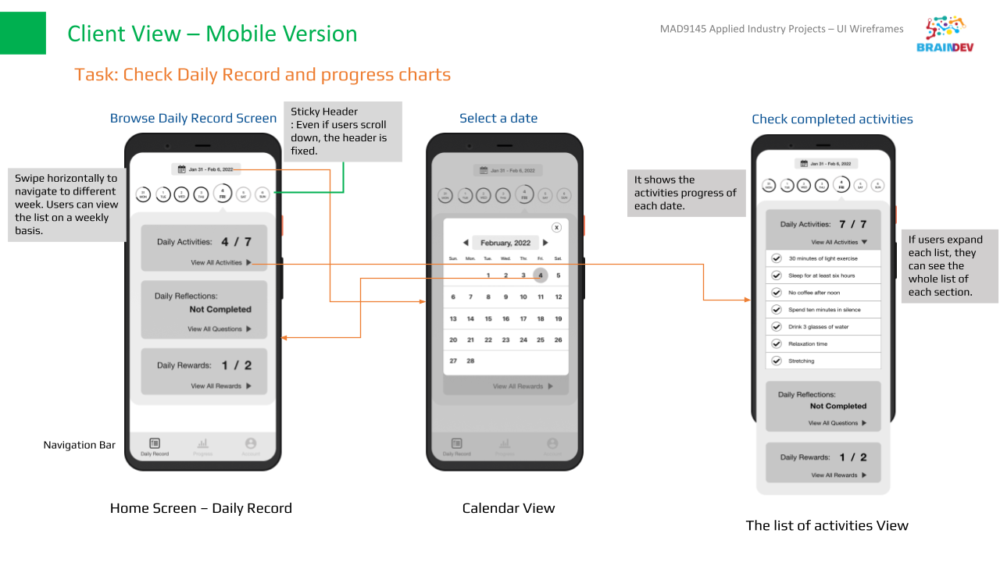

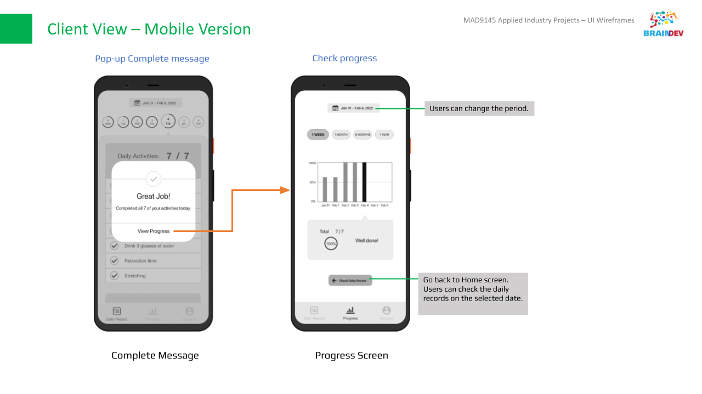

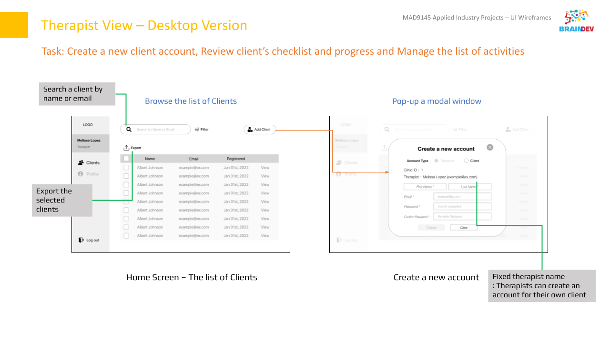

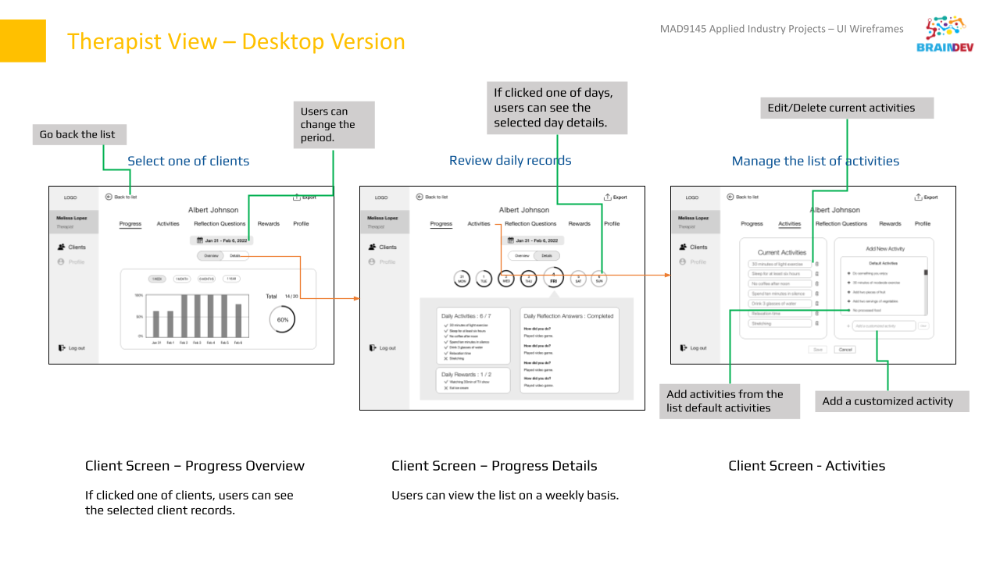

<!-- Visual Design -->

## Visual Design

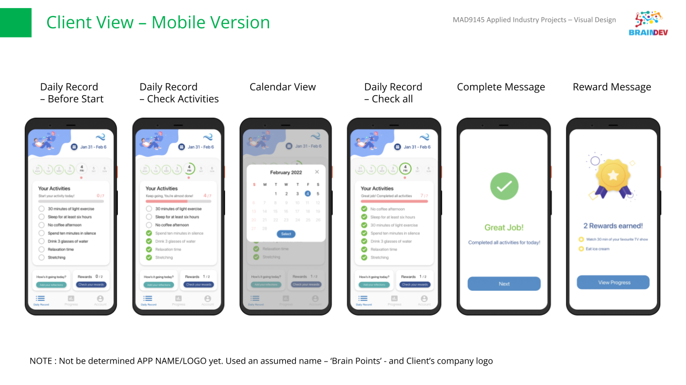

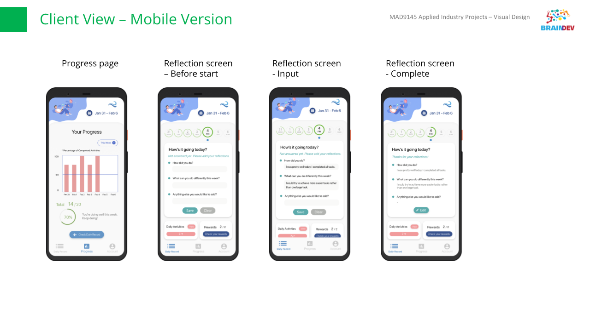

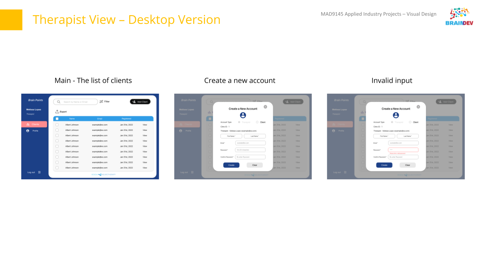

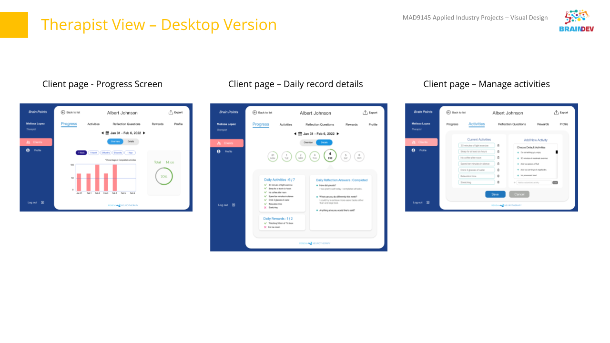


<!-- Interactive Visual MockUp -->

## Interactive Visual MockUp

[Interactive Visual MockUp](https://drive.google.com/file/d/1TboNtNL9bd1rT-zso9twuH2n0mCvlNox/view)

- Download the file and open with XD. 

<!-- Usability Testing Documentation -->

## Usability Testing Documentation

[Usability Testing Documentation](https://drive.google.com/drive/u/1/folders/1bsVdQCro01JpHc58OLFa0gFUnPSpZkYe)

- Usability Testing Documentation folder contains 'Test Plan' and 'Test Script'

<!-- Usability Test Results -->

## Usability Test Results

[Usability Test Results](https://docs.google.com/document/d/1j0onkOJqHDCsuk88BCcWH1uAelEg0_ZsvzCEeYJe6J0/)

- Information about the participants and findings.

<!-- High-Level Architecture -->

## High-Level Architecture

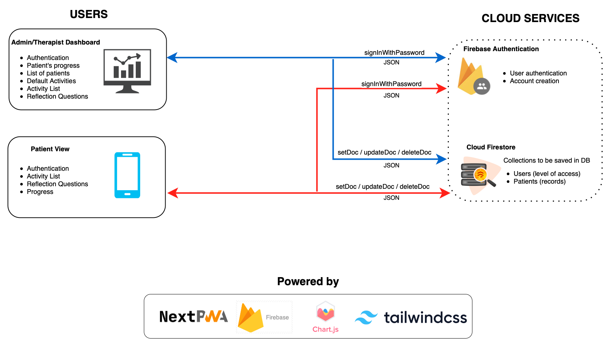

- On our users side or the front-end portion of the Diagram (the left) there are three types of users for the app. The Admin and Therapist users will typically be a dashboard portion and a patient view which will ideally be run on a mobile device using NextPWA (Progressive Web Application). 
- We are using Firebase as our backend for authentication and data storage using a JSON data format.
- We are using ChartJS to integrate chart technology and tailwind css for the styling on every part of the front end.

<!-- Technical Research -->

## Technical Research

[Technical Research Document](https://docs.google.com/document/d/1VJuTw1EakxJdmso2JJG-lz8Oa6ryuC1J/)

- Next.JS (next-pwa): Out of the box solution for building a PWA. Includes pre-configured SW, workbox, cache with fallbacks, maximum lighthouse score, among other features. It offers better performance compared to React.JS, it also makes the development faster compared to using Vanilla JavaScript. But, most important, it will meet the project requirements and consequently client’s needs

- Firebase: Platform backed by Google. It will be used for data storage (Firestore) and authentication. It is safe with a server located in Canada (northamerica-northeast1 – located in Montreal, QC) which meets the requirement that data needs to stay in Canada. 

- Tailwind CSS: Utility-first CSS framework with a very modern look and states out of the box. It installs as a package in NextJS. It will also help build a fully responsive and modern dashboard.

- Charts.js: Open-source library used to create charts. Includes 8 chart types (and mixed chart types), animations and it’s fully responsive. 

- Limitations: Although PWA works on every platform, based on the functional requirements (previously described) some of its functionalities are not supported by devices using iOS (ie: iPhones and iPads):


<!-- Getting Started -->

## Getting Started

To get a local copy up and running follow these simple example steps.

### Prerequisites

- A Working Computer/MacBook
- An Internet Connection
#### Brain Dev Mobile App/Dashboard 

- Install npm

```sh
npm install npm@latest -g
```

- Install Libraries

```sh
npm install
```

- Start the Server

```sh
npm run-script build
```

- Run the Server

```sh
npm run-script start
```

## Usage **

Use this space to show useful examples of how a project can be used. Additional screenshots, code examples and demos work well in this space. You may also link to more resources.

[Download the App for Phase 1]() ***

#### Current Screens in Development for Phase 1:

 ***

<!-- ROADMAP -->

## Roadmap

List of Sprint two features (and known issues, if any). 

#### Sprint Two Features
- Notifications
- Motivation integration with notifications
- Trial Version - authentication/profile not required. 
- Export of Data

#### Current Issues ***

- 

<!-- Contact -->

## Contact

**Project Lead:** [Alessandro de Jesus](mailto:deje0014@algonquinlive.com)

**Design Lead:** [Yoona Kim](mailto:kim00432@algonquinlive.com)

**Developer/Designer:** [Ekta Dudhatra](mailto:dudh0004@algonquinlive.com)

**Developer/Designer:** [Gyuyoung Lee](mailto:lee00777@algonquinlive.com)

**Developer/Designer:** [Chunyen (Daniel) Huang](mailto:huan0246@algonquinlive.com)

**Developer/Designer:** [Jacob Wilson](mailto:wils0936@algonquinlive.com)

<!-- Acknowledgements -->

## Acknowledgements

We would like to thank our client Renew Neurotherapy for giving us the opportunity to work on this project Specifically Sharie and . We would also like to thank our professors for the course [Adam Robillard](https://github.com/arobillard) and [Adesh Shah](https://github.com/shah0150) for guiding and supporting us during this proect. We would like to thank shadowwalker for their plugin [NextPWA](https://github.com/shadowwalker/next-pwa) which helped with the success of the project.